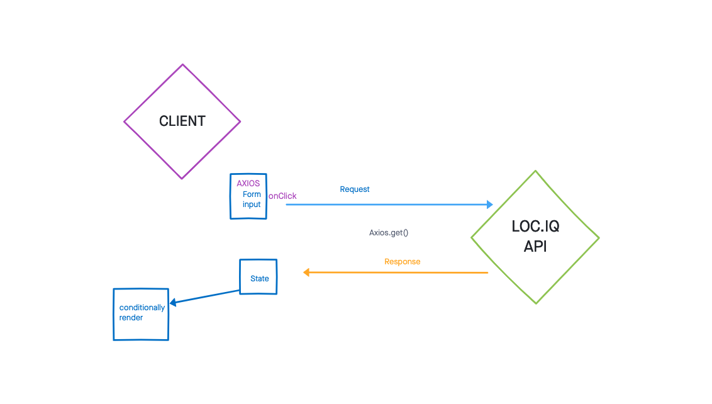

# City Explorer

**Author**: [Brandon Rimes](https://brandonrimes.net/)
**Version**: 1.0.0

## Overview
<!-- Provide a high level overview of what this application is and why you are building it, beyond the fact that it's an assignment for this class. (i.e. What's your problem domain?) -->

## Getting Started
<!-- What are the steps that a user must take in order to build this app on their own machine and get it running? -->

## Architecture

[Trello](https://trello.com/b/UvI9L0rq)

## Change Log

<!-- Use this area to document the iterative changes made to your application as each feature is successfully implemented. Use time stamps. Here's an example:

01-01-2001 4:59pm - Application now has a fully-functional express server, with a GET route for the location resource. -->

## Credit and Collaborations
<!-- Give credit (and a link) to other people or resources that helped you build this application. -->

- Name of feature: Locations

Estimate of time needed to complete: 60min

Start time: 20:23 EST

Finish time: _____

Actual time needed to complete: _____

- Name of feature: Map

Estimate of time needed to complete: _____

Start time: _____

Finish time: _____

Actual time needed to complete: _____

- Name of feature: Errors

Estimate of time needed to complete: _____

Start time: _____

Finish time: _____

Actual time needed to complete: _____
